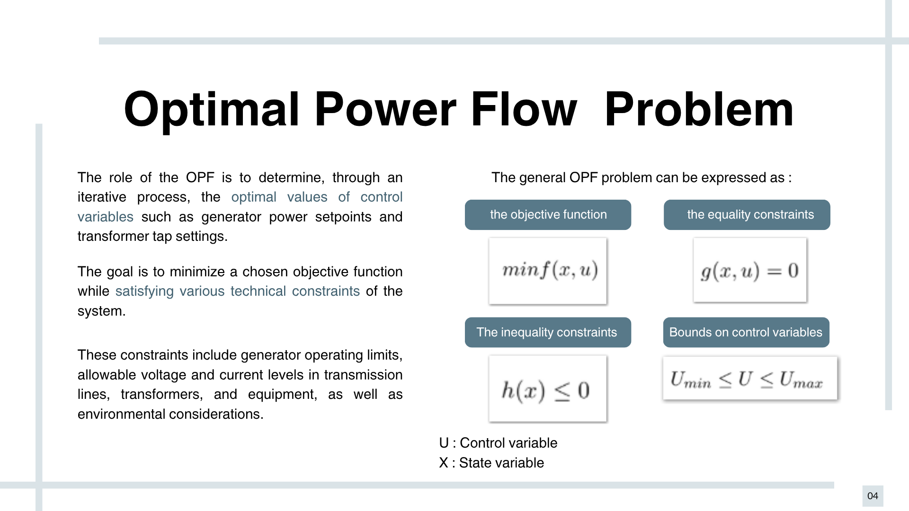
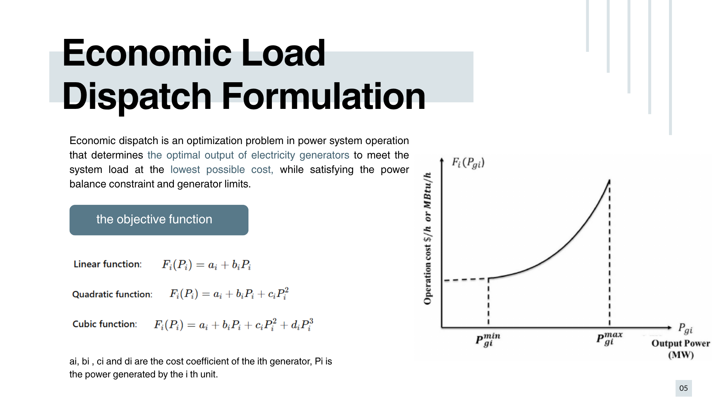
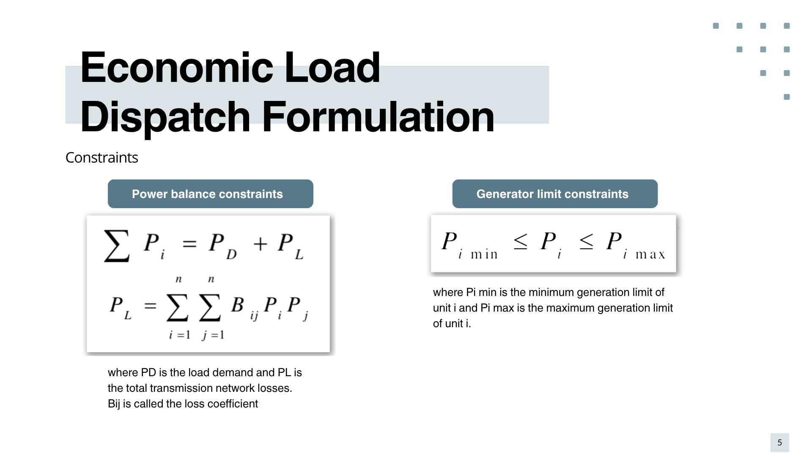
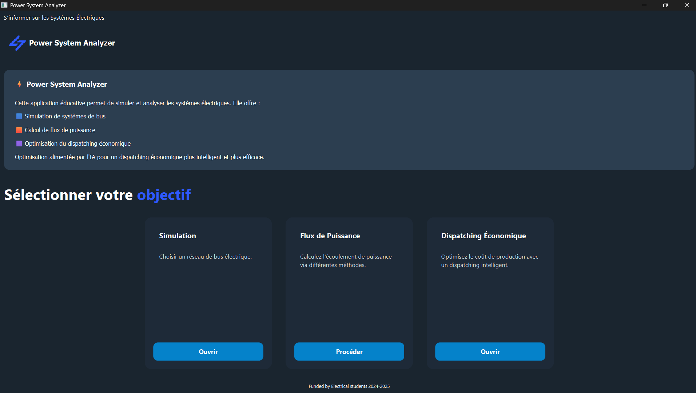
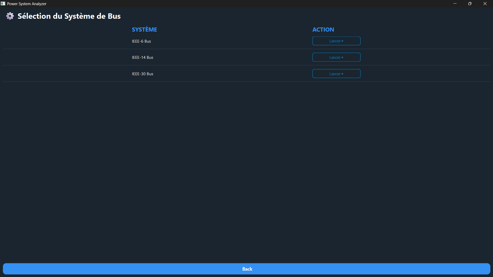
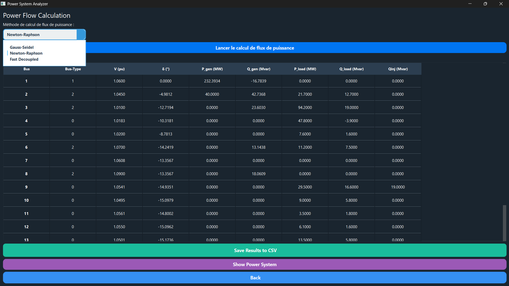
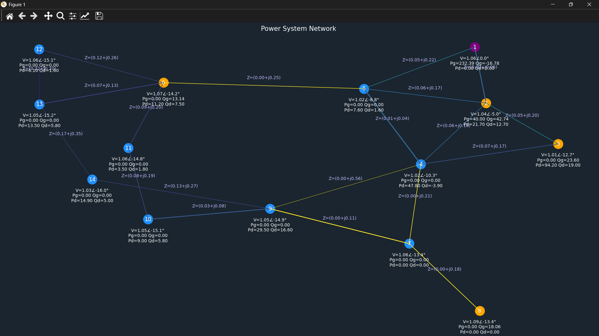
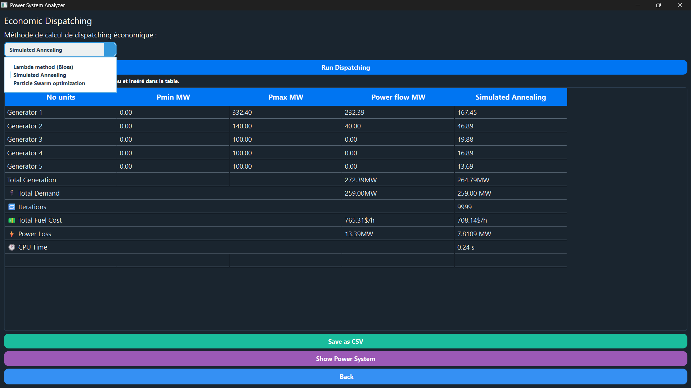

<h2>Optimal Power Flow Using Simulated Annealing</h2>

A <strong>PyQt5 application</strong> for analyzing IEEE test systems. The user selects a system, and the application calculates the <strong>bus admittance matrix</strong>, performs <strong>power flow analysis</strong>, and solves the <strong>Optimal Power Flow (OPF)</strong> problem using the <strong>Simulated Annealing</strong> algorithm.

    
    
    

<h2>Application Overview</h2>

The <strong>PyQt5 application</strong> provides a complete workflow for power flow analysis and Optimal Power Flow (OPF) using standard IEEE test systems.

<h3>1. Welcome Page</h3>

The application starts with a welcome page providing access to the different sections of the power system analysis.

    

<h3>2. System Selection</h3>

The user can select the desired <strong>IEEE test system</strong> to be analyzed.

    

<h3>3. Power Flow Analysis</h3>

The application calculates the bus admittance matrix and performs the power flow analysis using the selected method: <strong>Gauss-Seidel, Newton-Raphson, or Fast Decoupled</strong>.

    

<h3>4. System Visualization</h3>

The resulting system can be visualized, including the buses and the admittance values of the lines connecting them.

    

<h3>5. Optimal Power Flow</h3>

Finally, the application performs the <strong>Optimal Power Flow (OPF)</strong> using the <strong>Simulated Annealing</strong> algorithm. Other methods, such as <strong>PSO</strong> and the <strong>Lambda method</strong>, are also proposed.

    

